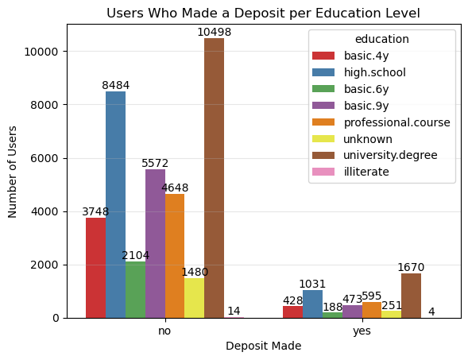

# Practical Application Assignment 17.1: ComparingClassifiers
The goal is to compare the performance of the classifiers (k-nearest neighbors, logistic regression, decision trees, and support vector machines) on a dataset related to the marketing of bank products over the telephone

## Introduction

This repository contains the Jupyter Notebook for the Application Assignment 17.1. This takes a sample jupyter notebook to complete the exercise to analyse UCI Bank Marketing Data Set in [bank-additional-full.csv] file in the data folder of this repository to build a machine learning application that uses classifications to evaluate customers that will accept the Long-term deposit application using features like job, marital status, education, housing and personal loan.

The goal of this project is to compare the performance of the following classifiers namely 
* K Nearest Neighbor
* Logistic Regression
* Decision Trees and 
* Support Vector Machines

In comparing the models, the training times and accuracy of the models will be recorded. This should provide an indication on the model that will provide predictions to determine which customer will accept the long term deposit bank product via a phone based marketing campaign.

## Business Understanding

The business objective is to identify key features for used car prices based on the dataset provided so that Car Dealers and their Sales Team can use these key features to understand the cars that they need to have in their inventory to increase sales.

For this application, we are using classfication in Machine Learning as we are comparing classsifiers. Classification is a supervised machine learning method where the model tries to predict the correct label of a given input data. In classification, the model is fully trained using the training data, and then it is evaluated on test data before being used to perform prediction on new unseen data.

### Business Objective
This dataset was provided for a Portugese banking institution and is a collection of the results of multiple marketing campaigns.  The analysis of the data shows that the marketing campaign was not very successful in getting customers to sign up for the long term deposit product.

From a business objective, the task of this Machine Learning project is to determine which factors could lead to a higher success rate. 

## Data Understanding
The data did not have any missing/null values in the columns/features. The dataset features that were reviewed included job, marital status, education, and loan types: personal and housing. These features were analyzed to determine its impact on whether the marketing campaigns were successful on the customers. Below are some charts that show the observations between certain features and their affect on whether customers made deposits.

Regardless of the measured features, most of the customers failed to sign up for a long term deposit. 

## Data Preparation
1. Renamed "Y" feature to "deposit"
2. Use features 1 - 7 (i.e., job, marital, education, default, housing, loan and contact ) to create a feature set
3. Split data into a train and test set

## Model Comparison
In this section, we will compare the performance of the Logistic Regression model to our KNN algorithm, Decision Tree, and SVM models. Using the default settings for each of the models, fit and score each. Also, be sure to compare the fit time of each of the models.

| Model Name  	        | Train Time                            | Train Accuracy	            | Test Accuracy | 
|-------------	        |:------------------------------------	|:-------------------------:	|:----------------------:	|
| Logistic Regression 	| 0.109                              | 0.8877597030973605        	| 0.8865420409484502                 |
| KNN                   | 10.6                              | 0.8924074780618084         	| 0.8781257586792911                  |
| Decision Tree       	| 0.562                              | 0.9256356005688322        	| 0.8608076393946751                  |  
| SVM                   | 34.7                              | 0.890395754569734         	| 0.8862992635753014                  |

Looking at the results from the model comparison, Decision Tree had the best training accuracy, but Logistic Regression recorded the fastest training time and the highest test accuracy. 
